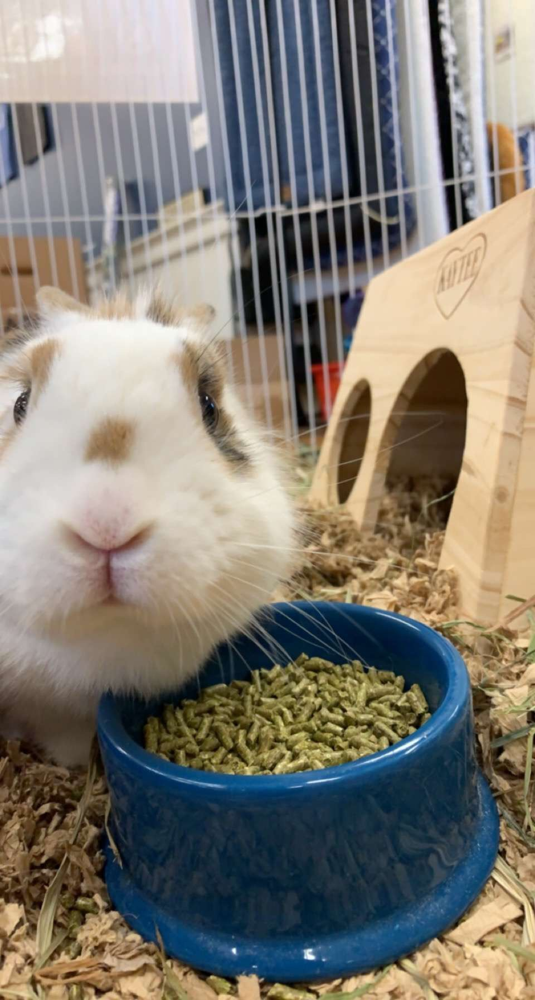

Hello, if you are reading this than you have succesfully reached my webiste for Lab 13! 

My name is Jarrod Daniels and I am currently a senior studying Informatics at the University of Massachuetts Amherst. I have an interest in many other subjects however and as a result I am completing minors in both biology and Japanese!

Outside of school I enjoy things like gardening, taking my dog for walks, listening to music, and playing video games. I also really like rabbits as apparent by the image below.

Although this website is quite bland, it holds the final lab for Biology 597GE. In the future I will hopefully like to build on a website such as this and make it a nice landing ground for anyone interested in my work.

As a final note, I just wanted to thank you for teaching as this semester, I definitely learned a lot more about R than I had previously thought! 

